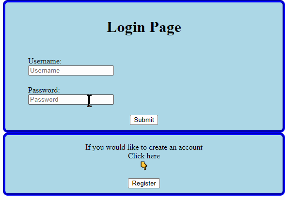

# Project 2 - *Full Stack Web Development*

**Full Stack Web Development** is a basic full-stack website using PHP and MySQL

Submitted by: **Maria Martinez**

Time spent: **1** week spent in total

## User Stories

The following **required** for basic site functionality is completed:

* [x] User can **page must have a section where a new user can register with a username and password**
* [x] User can ** section where returning users can log in** 
* [x] Onced logged in **Should be displayed:
* [x] welcome message to the user
* [x] a button that changes the background color of the current page
*[x](This functionality is largely up to you. You can toggle between multiple different
colors with each button click if you like.)
* [x] a logout button or link that takes them back to the login/registration/start page

The following **required** the adminstrator user are implemented:

* [ ]**When a user logs in successfully as Administrator, the page they see contains a table listing all
the users of the site by username and password, in sorted order by username (alphanumeric
ascending sorted order)** 

## Video Walkthrough

Here's a walkthrough of implemented user stories:

GIF created with [LiceCap](http://www.cockos.com/licecap/).

## Notes

Describe any challenges encountered while building the app.
I had to learn how to use MySQL and use a veritual mechine to host a server.

## License

    Copyright [2020] [name of copyright owner]

    Licensed under the Apache License, Version 2.0 (the "License");
    you may not use this file except in compliance with the License.
    You may obtain a copy of the License at

        http://www.apache.org/licenses/LICENSE-2.0

    Unless required by applicable law or agreed to in writing, software
    distributed under the License is distributed on an "AS IS" BASIS,
    WITHOUT WARRANTIES OR CONDITIONS OF ANY KIND, either express or implied.
    See the License for the specific language governing permissions and
    limitations under the License.
